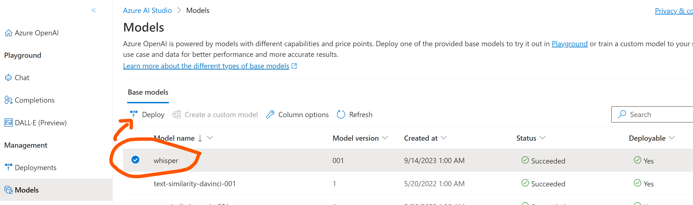
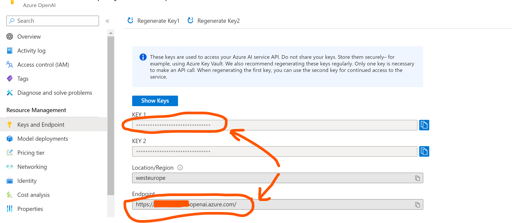
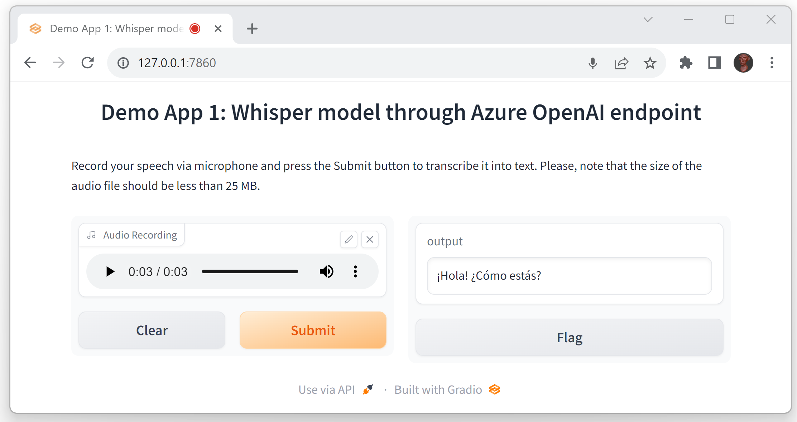
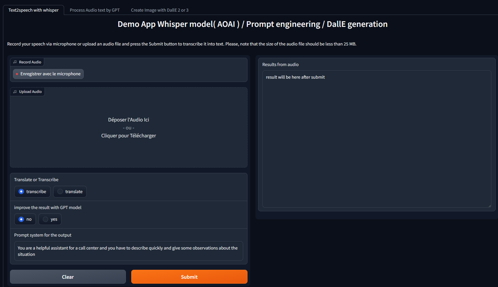

# Demo Whisper / GPT & DallE in the Gradio-powered Web apps

Whisper models allow you to transcribe and translate audio files, using their speech-to-text capabilities.
If you want to know more about the possibilities for Whisper take a look on this link
The languages 
DallE allow you to transform prompt to image

In this repo I'll demo how to utilise Whisper models offline or consume them through an Azure endpoint (either from [Azure OpenAI](https://learn.microsoft.com/en-us/azure/ai-services/openai/overview) or [Azure AI Speech](https://learn.microsoft.com/en-GB/azure/ai-services/speech-service/overview) resources).

There [are several difference and usecase ( real time, batch..) when when you have to use the Azure AI speech and AOAI Whisper](https://learn.microsoft.com/en-us/azure/ai-services/speech-service/whisper-overview)


openai/whisper: Robust Speech Recognition via Large-Scale Weak Supervision (github.com)
Prise en charge des langues – Service Speech - Azure AI services | Microsoft Learn
https://speech.microsoft.com/portal/
The Whisper model from OpenAI - Azure AI services | Microsoft Learn


Each option from the table of contents below is wrapped into a functional Web interface, powered by [Gradio](https://www.gradio.app/) platform.

If you want some deeper informations for Whisper follow theses links

and for DallE:
- The cookbook openAI [https://cookbook.openai.com/articles/what_is_new_with_dalle_3](https://cookbook.openai.com/articles/what_is_new_with_dalle_3)


## Table of contents:
- [Option 0 - Access to Whisper models in offline mode](https://github.com/olivMertens/AOAI-Whisper-Gradio#option-0---access-to-whisper-models-in-offline-mode)
- [Option 1 - Access to Whisper models via Azure OpenAI endpoint](https://github.com/olivMertens/AOAI-Whisper-Gradio#option-1---access-to-whisper-models-via-azure-openai-endpoint)
- [Option 2 - Access to Whisper models via Azure AI Speech endpoint](https://github.com/olivMertens/AOAI-Whisper-Gradio#option-2---access-to-whisper-models-via-azure-ai-speech-endpoint)


## Option 0 - Access to Whisper models in offline mode
Whisper model can be consumed offline. You may notice differences in its performance on the weaker local computers in comparison to an Azure based deployment. At the same time, this may serve certain scenarios where access to external resources is prohibited or not possible.

To instantiate Web app with offline Whisper functionality, please follow these steps:
1. Install gradio Python package. This will allow you to define and instantiate a Web app, that will run locally as a Web service.
```
pip install --upgrade gradio
```
2. Install openai-whisper Python package. It comes with a few pre-trained Whisper models of various sizes. E.g. "base" model may require ~1 Gb of RAM, while "large" one would expect ~10 Gb of RAM.
```
pip install --upgrade openai-whisper
```
3. Launch provided Python script for offline Web app.
```
python 0_Whisper_Offline.py
```
If successful, you should be able to access new Web app's interface at http://127.0.0.1:7860/ as shown below. You can now record your speech through the computer's microphone and transcribe it using one of selected Whisper models.

> **Note:** You may also require installation of [FFMpeg package](https://ffmpeg.org/) to make this solution work on your local computer.

## Option 1 - Access to Whisper models via Azure OpenAI endpoint
Whisper models are now available as a part of Azure OpenAI resource. To consume its API endpoint in your Gradio app, please follow these steps:
1. Deploy Whisper in available Azure OpenAI region.

2. Copy API endpoint and key details.


3. Install gradio Python package. This will allow you to define and instantiate a Web app, that will run locally as a Web service.
```
pip install --upgrade gradio
```
4. Install openai Python package. This is the client SDK that your Web app will use to interact with Azure OpenAI endpoint or Open Ai model if you need it
```
pip install --upgrade openai
```
5. Launch provided Python script for a Web app, integrated with Azure OpenAI endpoint.
```
python 1_Whisper_AOAI_endpoint.py
```
If successful, you should be able to access new Web app's interface at http://127.0.0.1:7860/ as shown below. You can now record your speech through the computer's microphone and transcribe it using Whisper model enabled in Azure OpenAI.


## Option 2 - Access to Whisper models via Azure AI Speech endpoint

Whisper models are also available through Azure AI Speech. Using batch API (similar to what is described [here](https://github.com/Azure-Samples/cognitive-services-speech-sdk/tree/master/samples/batch/python/python-client)), can increase audio file size limit up to 1 Gb.

## Option 3 - Improve Whisper model with Post processing and Dalle3 generation

In your terminal in visual studio code or powershell / cmd
```
python 3_Whisper_process_dalle.py
```
You could open your webbrowser at the localhost adress shown  http://127.0.0.1:7860

In example
```
Running on local URL:  http://127.0.0.1:7860
```



[Documentation on Dalle3](https://cookbook.openai.com/articles/what_is_new_with_dalle_3)

