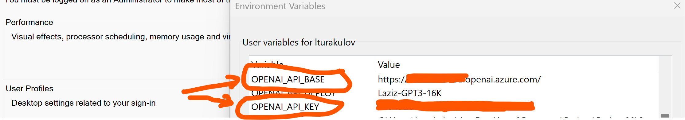
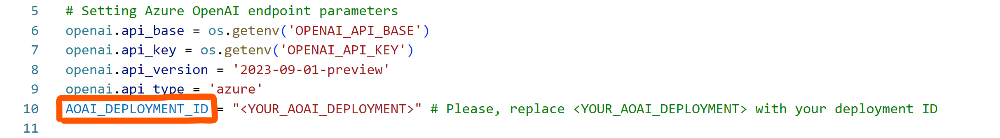

# Jump-start Python templates to demo Whisper in the Gradio-powered Web apps
Whisper models allow you to transcribe and translate audio files, using their speech-to-text capabilities.

In this repo I'll demo how to utilise Whisper models offline or consume them through an Azure endpoint (either from [Azure OpenAI](https://learn.microsoft.com/en-us/azure/ai-services/openai/overview) or [Azure AI Speech](https://learn.microsoft.com/en-GB/azure/ai-services/speech-service/overview) resources).

Each option from the table of contents below is wrapped into a functional Web interface, powered by [Gradio](https://www.gradio.app/) platform.

## Table of contents:
- [Option 0 - Access to Whisper models in offline mode](https://github.com/LazaUK/AOAI-Whisper-Gradio/blob/main#option-0---access-to-whisper-models-in-offline-mode)
- [Option 1 - Access to Whisper models via Azure OpenAI endpoint](https://github.com/LazaUK/AOAI-Whisper-Gradio/tree/main#option-1---access-to-whisper-models-via-azure-openai-endpoint)
- [Option 2 - Access to Whisper models via Azure AI Speech endpoint](https://github.com/LazaUK/AOAI-Whisper-Gradio/blob/main#option-2---access-to-whisper-models-via-azure-ai-speech-endpoint)

## Option 0 - Access to Whisper models in offline mode
Whisper model can be consumed offline. You may notice differences in its performance on the weaker local computers in comparison to an Azure based deployment. At the same time, this may serve certain scenarios where access to external resources is prohibited or not possible.

To instantiate Web app with offline Whisper functionality, please follow these steps:
1. Install gradio Python package. This will allow you to define and instantiate a Web app, that will run locally as a Web service.
```
pip install --upgrade gradio
```
2. Install openai-whisper Python package. It comes with a few pre-trained Whisper models of various sizes. E.g. "base" model may require ~1 Gb of RAM, while "large" one would expect ~10 Gb of RAM.
```
pip install --upgrade openai-whisper
```
3. Launch provided Python script for offline Web app.
```
python 0_Whisper_Offline.py
```
If successful, you should be able to access new Web app's interface at http://127.0.0.1:7860/ as shown below. You can now record your speech through the computer's microphone and transcribe it using one of selected Whisper models.

> **Note:** You may also require installation of [FFMpeg package](https://ffmpeg.org/) to make this solution work on your local computer.

## Option 1 - Access to Whisper models via Azure OpenAI endpoint
Whisper models are now available as a part of Azure OpenAI resource. To consume its API endpoint in your Gradio app, please follow these steps:
1. Deploy Whisper in available Azure OpenAI region.

2. Copy API endpoint and key details.

3. Create environment variables and assign to them copied API endpoint and key details from the previous step.

4. Set AOAI_DEPLOYMENT_ID variable to the name of your Azure OpenAI Whisper deployment.

5. Install gradio Python package. This will allow you to define and instantiate a Web app, that will run locally as a Web service.
```
pip install --upgrade gradio
```
6. Install openai Python package. This is the client SDK that your Web app will use to interact with Azure OpenAI endpoint.
```
pip install --upgrade openai
```
7. Launch provided Python script for a Web app, integrated with Azure OpenAI endpoint.
```
python 1_Whisper_AOAI_endpoint.py
```
If successful, you should be able to access new Web app's interface at http://127.0.0.1:7860/ as shown below. You can now record your speech through the computer's microphone and transcribe it using Whisper model enabled in Azure OpenAI.


## Option 2 - Access to Whisper models via Azure AI Speech endpoint
Whisper models are also available through Azure AI Speech. Using batch API (similar to what is described [here](https://github.com/Azure-Samples/cognitive-services-speech-sdk/tree/master/samples/batch/python/python-client)), can increase audio file size limit up to 1 Gb.

## Option 3 - Improve Whisper model with Post processing and DALL-E 3 generation
In your VSCode's terminal or PowerShell / CMD
```
python 3_Whisper_process_dalle.py
```
You should be able to access updated Web app's interface at http://127.0.0.1:7860/

